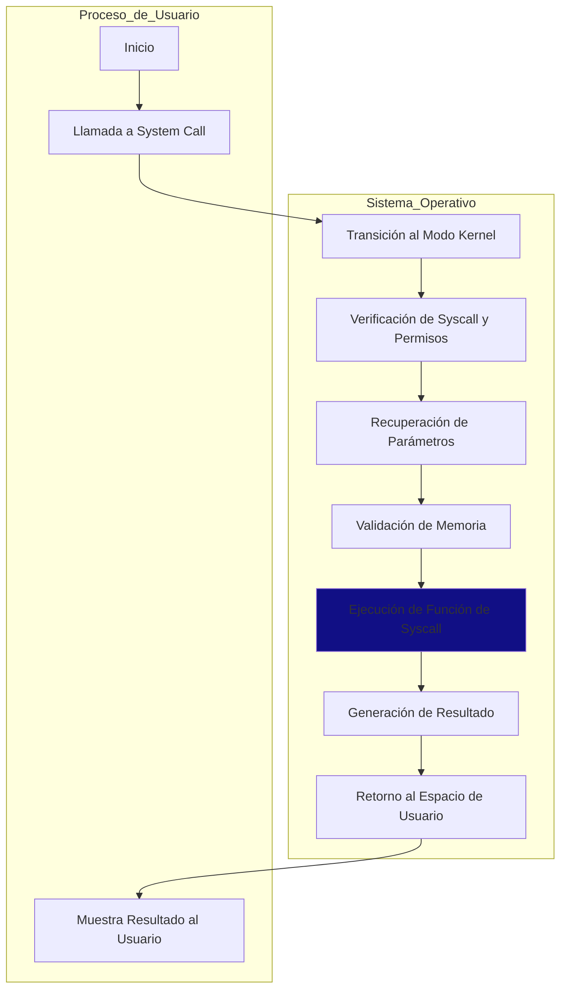

# OS-SysCall

Este repositorio contiene la implementación de system calls perzonalizadas en el kernel de Linux para resolver dos problemas específicos: la verificación de expresiones aritméticas y el cálculo del producto punto de vectores. Estos problemas implican el desarrollo de funciones en el kernel que son accesibles desde programas de usuario a través de system calls.

El objetivo principal de este proyecto es brindar una comprensión práctica de cómo agregar funcionalidades al kernel de Linux mediante el desarrollo de system calls personalizadas y cómo utilizar estas funcionalidades desde programas de usuario. Se explorarán los pasos necesarios para implementar las system calls, compilar el kernel y crear programas de usuario que hagan uso de estas llamadas al sistema.

## Herramientas utilizadas
- VirtualBox 7.0.14: para la creación de un entorno virtualizado en el que se ejecutará una distribución Linux.
- Ubuntu 16.04.6 Desktop: como el sistema operativo sobre el que se compila y prueba el kernel de Linux.
- [Linux Kernel 4.15.10](https://mirrors.edge.kernel.org/pub/linux/kernel/v4.x/linux-4.15.10.tar.xz) : la versión específica del kernel de Linux que se modificó.

### Contexto
<details>
  <summary>¿Qué es una Syscall</summary>
  <ol>
     Una syscall, o llamada al sistema, es un punto de interacción fundamental entre los programas de usuario y el núcleo (kernel) del sistema operativo. Permite a los programas solicitar servicios del kernel, tales como operaciones de E/S, creación y gestión de procesos, y acceso a hardware, de manera controlada y segura.

Estas llamadas al sistema son esenciales para realizar operaciones que de otra manera serían inaccesibles para un programa de usuario, como el acceso a hardware o la manipulación de archivos en el sistema. Las syscalls permiten a los programas interactuar con el sistema operativo de una manera segura y controlada, asegurando que solo se realicen operaciones permitidas y que se mantenga la estabilidad y seguridad del sistema.
  </ol>
</details>


<details>
  <summary>¿Cómo funciona una Syscall?</summary>
  <ol>
    En un sistema operativo Linux, la syscall funciona como una puerta de enlace entre el programa de usuario y el núcleo del sistema operativo. Cuando un programa necesita acceder a un recurso o servicio del sistema operativo, genera una interrupción de software a través de una syscall. Esta interrupción cambia el sistema del modo de usuario al modo de núcleo, permitiendo al programa interactuar de manera segura con el núcleo del sistema operativo.

El proceso exacto es el siguiente: Primero, el programa coloca los argumentos de la syscall en los registros del procesador. Luego, el programa realiza la syscall, que se implementa como una interrupción de software. Esta interrupción cambia el sistema del modo de usuario al modo de núcleo. Una vez en el modo de núcleo, el sistema operativo examina los argumentos de la syscall y determina qué servicio o recurso del sistema operativo se está solicitando. Luego, el sistema operativo ejecuta la operación solicitada, coloca el resultado en un lugar donde el programa pueda acceder a él (generalmente otro registro del procesador), y finalmente devuelve el control al programa de usuario.

Cada syscall tiene asociado un número único que el sistema operativo usa para identificar qué servicio o recurso se está solicitando. Los programas suelen utilizar una biblioteca de funciones, como la biblioteca de C de Unix (glibc), que proporciona funciones de alto nivel que a su vez realizan las syscalls necesarias.

Es importante recordar que, aunque este es el mecanismo general de cómo funcionan las syscalls en Linux, los detalles específicos pueden variar dependiendo de la arquitectura del procesador y la versión del sistema operativo.
  </ol>
</details>

# Problema 1: Verificación de Expresiones Aritméticas
El objetivo de este problema es desarrollar una función que determine si una expresión aritmética está correctamente cerrada en cuanto a paréntesis y corchetes. Para ello, se debe implementar una llamada al sistema (system call) en el kernel de Linux y crear un programa que haga uso de esta llamada para verificar expresiones aritméticas.

## Implementación de la System Call
La función de verificación de expresiones aritméticas se implementará como una system call en el kernel de Linux. El proceso para agregar esta system call implica los siguientes pasos:

1. Implementación de la Función en el Kernel: Se desarrollará una función en C, en el código fuente del kernel que llevará a cabo la verificación de la expresión aritmética. Esta función recibirá como parámetro un puntero a la cadena que contiene la expresión y retornará un valor booleano indicando si la expresión está correctamente cerrada o no.
2. Definición de la System Call: Se definirá una nueva system call en el kernel, que será el punto de entrada para invocar la función de verificación desde el espacio de usuario. Este tiene un número de identificación único 333.
4. Compilación del Kernel: Se recompilará el kernel de sistema operativo para incorporar la nueva system call.


# Problema 2: Producto Punto de Vectores

El segundo problema consiste en desarrollar una función que calcule el producto punto de dos vectores de tamaño n. Esta función se implementará como una system call en el kernel de Linux, y se creará un programa de usuario que haga uso de esta system call para calcular el producto punto de dos vectores dados.

## Implementación de la System Call
La función de cálculo del producto punto de vectores se implementará como una system call en el kernel de Linux. Similar al Problema 1, se sigue un proceso de implementación, definición, y compilación en el kernel de Linux. Esta system call se asigna con el número 334.

## Pasos para compilar el Kernel (sin cambios)
Detallamos cómo preparar el entorno de compilación, descargar y descomprimir el código fuente del kernel, instalar dependencias necesarias, y finalmente compilar y reinstalar el kernel modificado. Los pasos incluyen:

1. Instalar una distribución estable de Linux (Ubuntu)
2. Descargar VirtualBox
3. Montar la imagen asegurarse de darle el espacio de memoria y disco necesario
4. Verificar en consola la versión de su distro para descargar el código fuente `lsb_release -a`
5. Verificar la versión del Kernel `uname -r`
6. Descargar el código de una versión igual o superior de la distribución seleccionada.
7. Se debe de descargar todo el código en la carpeta usr/src
8. Correr los siguintes comandos:
   ```bash
   a.	sudo apt-get install gcc
   b.	sudo apt-get install libncurses5-dev
   c.	sudo apt-get install bison
   d.	sudo apt-get install flex
   e.	sudo apt-get install libssl-dev
   f.	sudo apt-get install libelf-dev
   g.	sudo apt-get update
   h.	sudo apt-get upgrade
   ```
9. Compilar el Kernel
    ```bash
    a.	sudo make menuconfig
    b.	sudo make –j(# de procesadores a usar)
    ```
    
10. Para instalar su versión: `sudo make modules_install install`
   
11. Verificar que compiló correctamente: `uname –r`

## Pasos para compilar el Kernel modificado (con las nuevas Syscalls)
.......
.......
.......
.......
.......

# Programa de Prueba
Se proporciona un programa de prueba en C que demuestra cómo invocar las nuevas system calls desde el espacio de usuario. Este programa pide al usuario que ingrese vectores para el cálculo del producto punto y una expresión para verificar si está balanceada, haciendo uso de las system calls sys_puntoproducto (334) y sys_expresioncerrada (333) respectivamente.

## Diagrama conceptual Usuario - System Call



### Se agregan las Syscalls nuevas a la tabla de syscalls del kernel


### Aquí se presenta la descripción de nuestro prototipo, que es básicamente la estructura mediante la cual el Kernel registrará la existencia de nuestra llamada al sistema, permitiéndole luego ubicar dónde está definida dicha llamada al sistema.


### Aquí se agregó en el Makefile, dentro de la carpeta del Kernel, los outputs de las 2 funciones implementadas para el Syscall. 


## Autores (UFM)
- Marcela Melgar
- Nickolas Nolte
- Jose Reyes
- Esteban Samayoa
