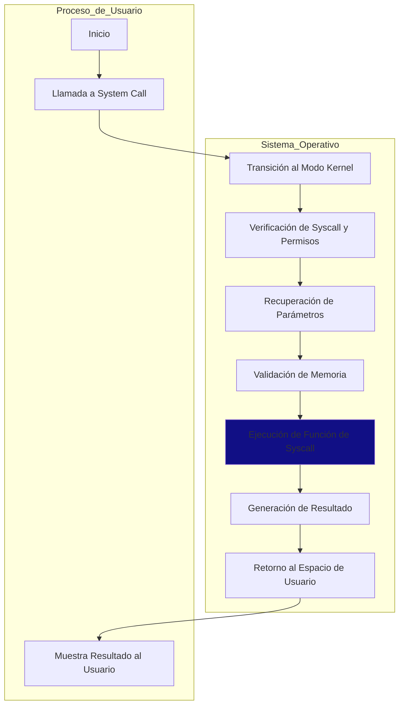

# OS-SysCall

Este repositorio contiene la implementación de system calls en el kernel de Linux para resolver dos problemas específicos: la verificación de expresiones aritméticas y el cálculo del producto punto de vectores. Estos problemas implican el desarrollo de funciones en el kernel que son accesibles desde programas de usuario a través de system calls.

El objetivo principal de este proyecto es brindar una comprensión práctica de cómo agregar funcionalidades al kernel de Linux mediante el desarrollo de system calls y cómo utilizar estas funcionalidades desde programas de usuario. Se explorarán los pasos necesarios para implementar las system calls, compilar el kernel y crear programas de usuario que hagan uso de estas llamadas al sistema.

## Herramientas utilizadas
- VirtualBox 7.0.14
- Ubuntu 16.04.6 Desktop
- [Linux Kernel 4.15.10](https://mirrors.edge.kernel.org/pub/linux/kernel/v4.x/linux-4.15.10.tar.xz)


# Problema 1: Verificación de Expresiones Aritméticas
El objetivo de este problema es desarrollar una función que determine si una expresión aritmética está correctamente cerrada en cuanto a paréntesis y corchetes. Para ello, se debe implementar una llamada al sistema (system call) en el kernel de Linux y crear un programa que haga uso de esta llamada para verificar expresiones aritméticas.

## Implementación de la System Call
La función de verificación de expresiones aritméticas se implementará como una system call en el kernel de Linux. El proceso para agregar esta system call implica los siguientes pasos:

1. Implementación de la Función en el Kernel: Se desarrollará una función en el código fuente del kernel que llevará a cabo la verificación de la expresión aritmética. Esta función recibirá como parámetro un puntero a la cadena que contiene la expresión y retornará un valor booleano indicando si la expresión está correctamente cerrada o no.
2. Definición de la System Call: Se definirá una nueva system call en el kernel, que será el punto de entrada para invocar la función de verificación desde el espacio de usuario.
3. Compilación del Kernel: Se recompilará el kernel de sistema operativo para incorporar la nueva system call.


# Problema 2: Producto Punto de Vectores

El segundo problema consiste en desarrollar una función que calcule el producto punto de dos vectores de tamaño n. Esta función se implementará como una system call en el kernel de Linux, y se creará un programa de usuario que haga uso de esta system call para calcular el producto punto de dos vectores dados.

## Implementación de la System Call
La función de cálculo del producto punto de vectores se implementará como una system call en el kernel de Linux. El proceso para agregar esta system call será similar al descrito para el Problema 1.

## Pasos
1. Instalar una distribución estable de Linux (Ubuntu)
2. Descargar VirtualBox
3. Montar la imagen asegurarse de darle el espacio de memoria y disco necesario
4. Verificar en consola la versión de su distro para descargar el código fuente `lsb_release -a`
5. Verificar la versión del Kernel `uname -r`
6. Descargar el código de una versión igual o superior de la distribución seleccionada.
7. Se debe de descargar todo el código en la carpeta usr/src
8. Correr los siguintes comandos:
   ```bash
   a.	sudo apt-get install gcc
   b.	sudo apt-get install libncurses5-dev
   c.	sudo apt-get install bison
   d.	sudo apt-get install flex
   e.	sudo apt-get install libssl-dev
   f.	sudo apt-get install libelf-dev
   g.	sudo apt-get update
   h.	sudo apt-get upgrade
   ```

### Diagrama conceptual Usuario - System Call



### Se agregan las Syscalls nuevas a la tabla de syscalls del kernel


